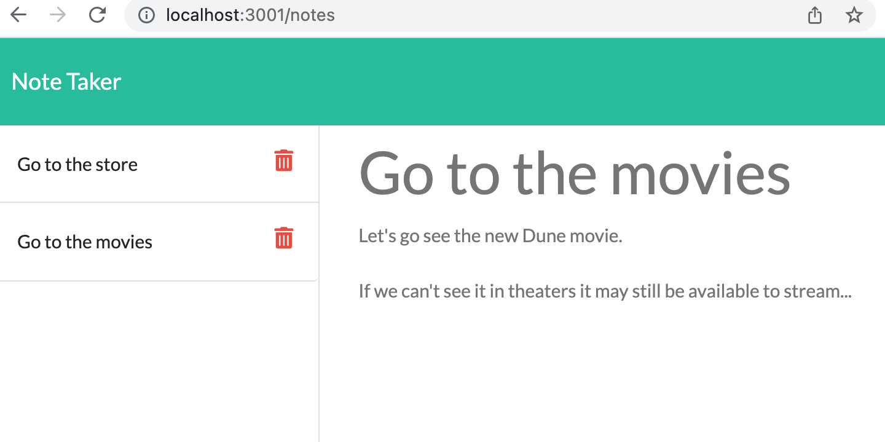

## Jot Down and Deploy

## Description
This app is deployed on Heroku at [this link](https://jot-down-and-deploy.herokuapp.com/). Visit the link to add and delete existing notes by utilizing a client-server interface. Simply click on a note title via the directory on page-left to access its corresponding text information. Use the two buttons on the top right of the screen to save the note or add a new note instead. Use the trash bin icon once the note is saved on the directory to delete notes.

## Screenshot
